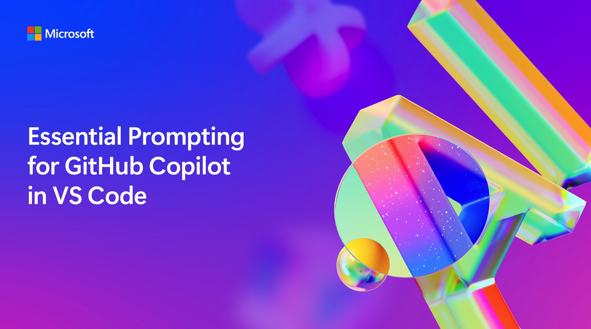

# Essential Prompting for GitHub Copilot in VS Code

This repo is a companion to this session at Microsoft AI Tour, a worldwide tour of events.

> Learn more about Microsoft AI Tour on the official website.

## Session Description

In this session you will learn how to set up GitHub Copilot in VS Code and then use it to do some interesting things that will save you time and effort.

## Learning Outcomes

In this session, you will learn how to:

 - Use the Copilot Chat window, along with chat participants and variables, to brainstorm solutions for your project.
 - Use inline chat in the editor to refactor and document your code.
 - Use inline chat in the terminal to execute time-saving commands.

## Technology Used

- VS Code
- [GitHub Copilot](https://github.com/features/copilot)

## Additional Resources and Continued Learning

You can find additional resources, including the slides of the presentation, [here](./session-delivery-resources/README.md).

If you will present this talk, you can find the [session delivery resources](./session-delivery-resources/README.md). 

## Content Owners

<!-- ALL-CONTRIBUTORS-LIST:START - Do not remove or modify this section -->

<table>
  <tr>
      <td align="center"><a href="http://learnanalytics.microsoft.com">
        
          <b>Burke Holland</b></a> 
          <a href="https://github.com/burkeholland" title="talk">📢</a> 
      </td>
  </tr>
  <tr>
      <td align="center"><a href="http://learnanalytics.microsoft.com">
           
          <b>Rob Conery</b></a> 
          <a href="https://github.com/robconery" title="talk">📢</a> 
      </td>
  </tr>
</table>

<!-- ALL-CONTRIBUTORS-LIST:END -->

## Responsible AI

Microsoft is committed to helping our customers use our AI products responsibly, sharing our learnings, and building trust-based partnerships through tools like Transparency Notes and Impact Assessments. Many of these resources can be found at https://aka.ms/RAI. Microsoft’s approach to responsible AI is grounded in our AI principles of fairness, reliability and safety, privacy and security, inclusiveness, transparency, and accountability.

Large-scale natural language, image, and speech models - like the ones used in this sample - can potentially behave in ways that are unfair, unreliable, or offensive, in turn causing harms. Please consult the Azure OpenAI service Transparency note to be informed about risks and limitations.

The recommended approach to mitigating these risks is to include a safety system in your architecture that can detect and prevent harmful behavior. Azure AI Content Safety provides an independent layer of protection, able to detect harmful user-generated and AI-generated content in applications and services. Azure AI Content Safety includes text and image APIs that allow you to detect material that is harmful. We also have an interactive Content Safety Studio that allows you to view, explore and try out sample code for detecting harmful content across different modalities. The following quickstart documentation guides you through making requests to the service.

Another aspect to take into account is the overall application performance. With multi-modal and multi-models applications, we consider performance to mean that the system performs as you and your users expect, including not generating harmful outputs. It's important to assess the performance of your overall application using generation quality and risk and safety metrics.

You can evaluate your AI application in your development environment using the prompt flow SDK. Given either a test dataset or a target, your generative AI application generations are quantitatively measured with built-in evaluators or custom evaluators of your choice. To get started with the prompt flow sdk to evaluate your system, you can follow the quickstart guide. Once you execute an evaluation run, you can visualize the results in Azure AI Studio.
